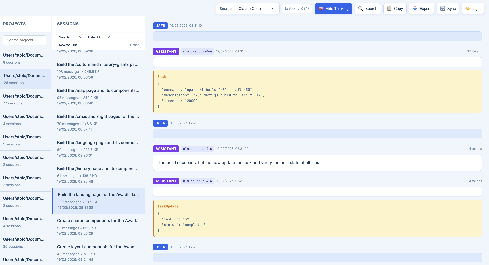
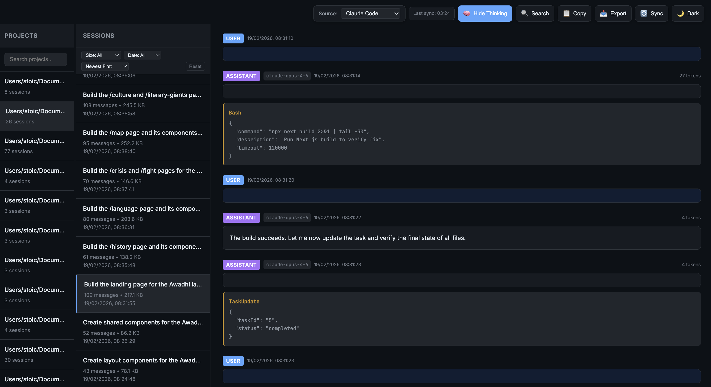

<div align="center">
<h1>Claude History Viewer</h1>
<p>A lightweight web app to browse and view your Claude Code conversation history</p>

<p>
  <a href="#features">Features</a> •
  <a href="#installation">Installation</a> •
  <a href="#usage">Usage</a> •
  <a href="#screenshots">Screenshots</a>
</p>

<p>
  
  
  
  <a href="http://makeapullrequest.com">
    
  </a>
</p>
</div>

---

## Features

- **Three-panel layout** — Projects → Sessions → Conversation
- **Auto-sync** — Backs up data from `~/.claude/projects/` every hour
- **Theme support** — Light (soft blue) and Dark modes
- **Rich display** — User/Assistant messages, thinking blocks, tool usage, tokens
- **Search** — Find projects and conversations quickly

## Installation

```bash
git clone https://github.com/YOUR_USERNAME/claude-history-viewer.git
cd claude-history-viewer
```

## Usage

**One command to run:**

```bash
./run.sh
```

Or manually:

```bash
pip install -r requirements.txt
python app.py
```

Open **http://localhost:5050** in your browser.

## How It Works

1. **Startup** — Copies data from `~/.claude/projects/` to local `./data/` folder
2. **Background sync** — Updates every hour automatically
3. **Manual sync** — Click the sync button anytime

## Screenshots

| Light Mode | Dark Mode |
|------------|-----------|
|  |  |

## Project Structure

```
claude-history-viewer/
├── app.py              # Flask backend
├── run.sh              # Run script
├── requirements.txt    # Dependencies
├── data/               # Synced data (auto-created)
└── templates/
    └── index.html      # Frontend
```

## Requirements

- Python 3.7+
- Flask 2.0+
- flask-cors

## License

MIT

---

<div align="center">
<sub>Built for browsing Claude Code conversations</sub>
</div>
