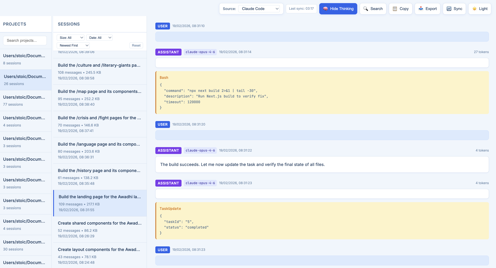
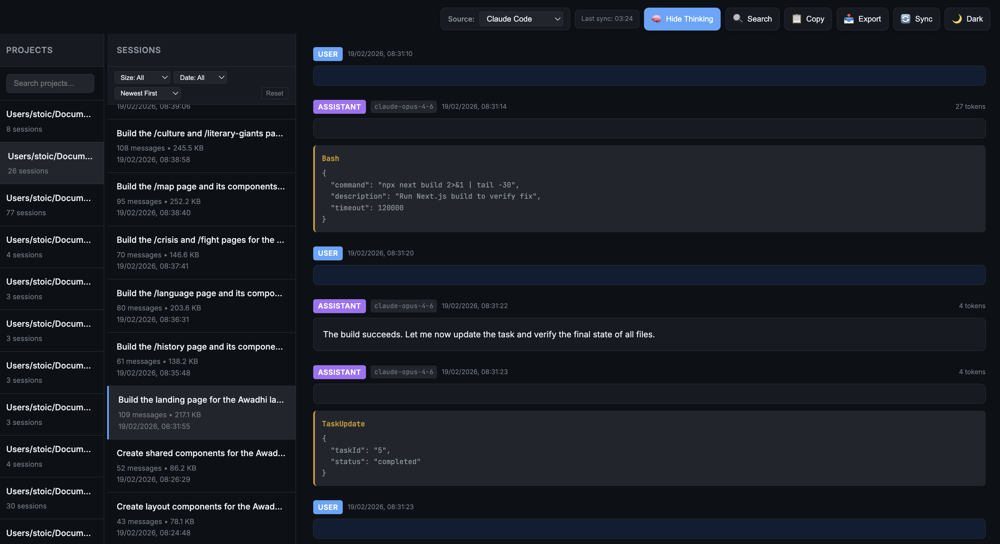

<div align="center">
  <div align="center">

</div>

<div align="center">

<h3>Your AI coding agent just edited 30 files across 6 directories.<br>What actually happened?</h3>

<p>
Browse every session from Claude Code, OpenAI Codex, and Gemini CLI
the thinking, the tool calls, the file changes, the token costs.
All in one local interface. Nothing leaves your machine.
</p>

</div>

<p>
  <a href="#features">Features</a> •
  <a href="#supported-tools">Supported Tools</a> •
  <a href="#installation">Installation</a> •
  <a href="#usage">Usage</a> •
  <a href="#screenshots">Screenshots</a>
</p>

<p>
  
  
  
  <a href="http://makeapullrequest.com">
    
  </a>
</p>
</div>

<!-- <div align="center">
<table>
<tr>
<td align="center">
<br>
<sub><b>Claude Code</b></sub>
</td>
<td align="center">
<br>
<sub><b>OpenAI Codex</b></sub>
</td>
<td align="center">
<br>
<sub><b>Gemini CLI</b></sub>
</td>
</tr>
</table>
</div> -->

---

| Light Mode | Dark Mode |
|------------|-----------|
|  |  |


## Installation

### Via uv tool (Recommended)

[uv](https://github.com/astral-sh/uv) is a fast Python package installer. Install it first if you haven't:

```bash
curl -LsSf https://astral.sh/uv/install.sh | sh
```

Then install clicodelog as an isolated tool:

```bash
uv tool install clicodelog
```

To upgrade:
```bash
uv tool upgrade clicodelog
```

### Via pip

```bash
pip install clicodelog
```

### From source

```bash
git clone https://github.com/monk1337/clicodelog.git
cd clicodelog
uv tool install -e .
# or with pip:
pip install -e .
```

---

## Usage

After installation, simply run:

```bash
clicodelog
```

The app will:
- Auto-kill any process on port **6126** (if occupied)
- Sync data from all AI coding agent sources
- Start a web server at **http://localhost:6126**

### Command Options

```bash
clicodelog --help               # Show all options
clicodelog --port 8080          # Use custom port
clicodelog --host 0.0.0.0       # Bind to all interfaces
clicodelog --no-sync            # Skip initial data sync
clicodelog --debug              # Run in debug mode
```

### Alternative: Run from source

```bash
git clone https://github.com/monk1337/clicodelog.git
cd clicodelog
python -m clicodelog.cli
```

## Why Developers Use It

<table>
<tr>
<td>🧠</td>
<td><b>See the full chain of reasoning</b><br>Read the agent's thinking blocks, tool calls, and decisions in a clean conversation view. No more squinting at raw JSONL.</td>
</tr>
<tr>
<td>🔍</td>
<td><b>Track what actually ran</b><br>Every file read, shell command, and edit — laid out clearly so you can audit what the agent did before you commit.</td>
</tr>
<tr>
<td>📊</td>
<td><b>Spot wasted tokens</b><br>Session-level token stats (input, output, cached) so you can see which runs were efficient and which went in circles.</td>
</tr>
<tr>
<td>🔀</td>
<td><b>All your agents, one place</b><br>Claude Code, Codex, and Gemini CLI side by side. Same interface, same workflow, no context switching.</td>
</tr>
<tr>
<td>🔒</td>
<td><b>Nothing leaves your machine</b><br>Fully local. Reads from your existing log directories, syncs to a local backup. No cloud, no accounts, no telemetry.</td>
</tr>
</table>

---

## Supported Tools

| Tool | Source Directory | Status |
|------|------------------|--------|
| **Claude Code** | `~/.claude/projects/` | ✅ Supported |
| **OpenAI Codex** | `~/.codex/sessions/` | ✅ Supported |
| **Gemini CLI** | `~/.gemini/tmp/` | ✅ Supported |

### Claude Code

- Sessions organized by project directory
- Displays summaries, messages, thinking blocks, and tool usage
- Shows model metadata and token usage

### OpenAI Codex

- Sessions organized by date (`YYYY/MM/DD/`)
- Groups sessions by working directory (cwd) as projects
- Displays messages, function calls, and reasoning blocks
- Filters out system prompts for cleaner inspection

### Gemini CLI

- Sessions stored as JSON files in `{hash}/chats/session-*.json`
- Groups sessions by project hash
- Displays messages, thoughts (thinking), and tool calls
- Shows token usage (input, output, cached)

---

### CLI Options

```bash
clicodelog --help               # Show help message
clicodelog --version            # Show version
clicodelog --port 8080          # Run on custom port (default: 6126)
clicodelog --host 0.0.0.0       # Bind to all interfaces (default: 127.0.0.1)
clicodelog --no-sync            # Skip initial data sync
clicodelog --debug              # Run in debug mode
```

**Note:** The app automatically kills any process running on the specified port before starting.

---

## How It Works

- **Startup sync** — Copies logs from source directories into local `./data/`
- **Background sync** — Automatically refreshes every hour
- **Manual sync** — Trigger a sync for the active source via UI
- **Source switching** — Switch between Claude Code, Codex, and Gemini CLI

---

## Data Storage

```
data/
├── claude-code/          # Claude Code backup
│   ├── -Users-project1/
│   │   ├── session1.jsonl
│   │   └── session2.jsonl
│   └── -Users-project2/
├── codex/                # OpenAI Codex backup
│   └── 2026/
│       └── 01/
│           ├── 16/
│           │   └── rollout-xxx.jsonl
│           └── 17/
└── gemini/               # Gemini CLI backup
    ├── {project-hash-1}/
    │   └── chats/
    │       ├── session-2026-01-17T12-57-xxx.json
    │       └── session-2026-01-17T13-04-xxx.json
    └── {project-hash-2}/
```

---

## Controls

| Control | Action |
|---------|--------|
| Source dropdown | Switch between supported tools |
| 📥 Export | Download current session as .txt |
| 🔄 Sync | Manually refresh logs from source |
| ☀️ / 🌙 Theme | Toggle light/dark mode |

---

## Screenshots

| Light Mode | Dark Mode |
|------------|-----------|
|  |  |

---

## Project Structure

```
clicodelog/
├── app.py              # Flask backend (multi-source support)
├── run.sh              # Run script
├── requirements.txt    # Dependencies
├── data/               # Synced logs (auto-created)
│   ├── claude-code/
│   ├── codex/
│   └── gemini/
└── templates/
    └── index.html      # Frontend
```

---

## API Endpoints

| Endpoint | Method | Description |
|----------|--------|-------------|
| `/api/sources` | GET | List available sources |
| `/api/sources/<id>` | POST | Set active source |
| `/api/projects?source=` | GET | List projects |
| `/api/projects/<id>/sessions?source=` | GET | List sessions |
| `/api/projects/<id>/sessions/<id>?source=` | GET | Fetch session |
| `/api/sync?source=` | POST | Trigger sync |
| `/api/status?source=` | GET | Sync status |

---

## Requirements

- Python 3.7+
- Flask 2.0+
- flask-cors

---

## Adding New Sources

To add support for another CLI-based AI tool, update `app.py`:

```python
SOURCES = {
    "claude-code": {
        "name": "Claude Code",
        "source_dir": Path.home() / ".claude" / "projects",
        "data_subdir": "claude-code"
    },
    "codex": {
        "name": "OpenAI Codex",
        "source_dir": Path.home() / ".codex" / "sessions",
        "data_subdir": "codex"
    },
    "gemini": {
        "name": "Gemini CLI",
        "source_dir": Path.home() / ".gemini" / "tmp",
        "data_subdir": "gemini"
    },
    # Add new tool here
}
```

Then implement the corresponding parser for its log format.

```
 @misc{clicodelog2026,                                                                                                                                                      
    title        = {clicodelog: Unified Session Inspector for CLI AI Coding Agents},
    author       = {Pal, Ankit},                                                                                                                                             
    year         = {2026},
    howpublished = {\url{https://github.com/monk1337/clicodelog}},                                                                                                           
    note         = {Local web UI for browsing Claude Code, OpenAI Codex, and Gemini CLI session logs - thinking blocks, tool calls, file edits, and token costs}             
  }       
```
---

## License

MIT

---

<div align="center">
<sub>Built for inspecting what AI coding agents actually did.</sub>
</div>

```


